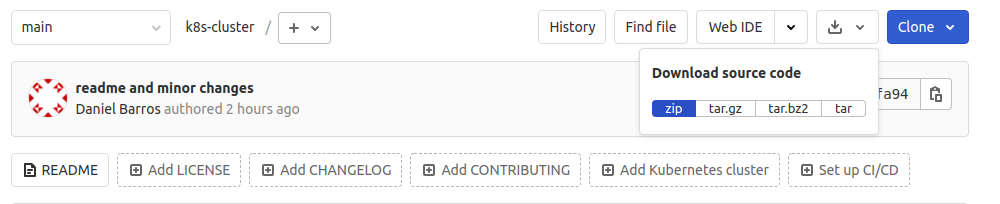
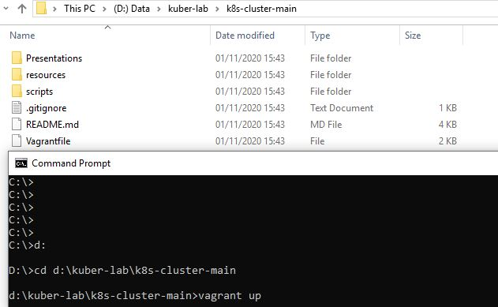
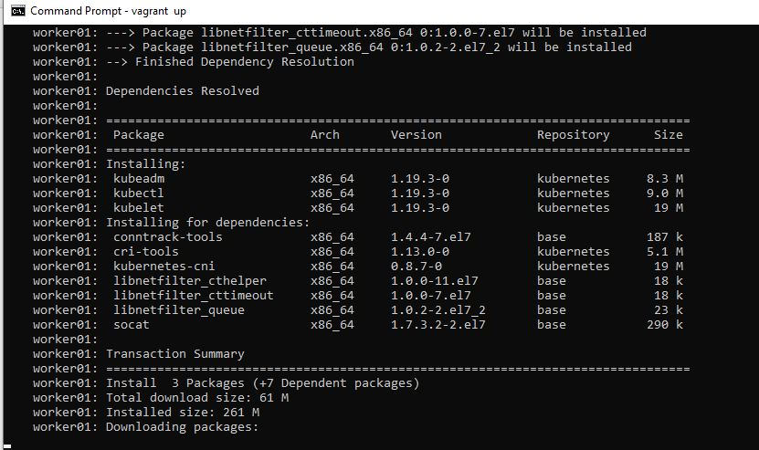
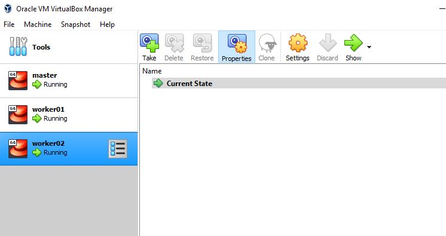
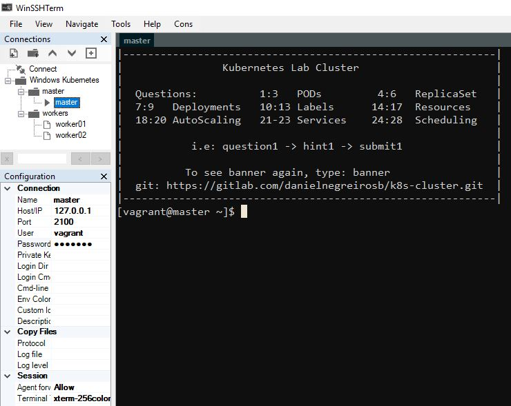

# k8s-cluster Installation

#### Environments

It has been tested on both Windows and Linux.

#### Requirements

You need to have installed:

- VirtualBox
    - https://www.virtualbox.org/wiki/Downloads
    
- Vagrant
    - https://www.vagrantup.com/downloads.html
    
It will help to have installed, but it's not mandatory

- Git
    - https://git-scm.com/downloads
    
    
#### Installation

Taking as true that Vagrant and Virtual Box has been already installed.

##### - Windows

- Download the code and place into your favorite directory directory:  https://gitlab.com/danielnegreirosb/k8s-cluster/-/archive/main/k8s-cluster-main.zip
 

- Open a CMD terminal go to your Directory where you extracted the code then:
- Move to k8s-cluster-main directory
``
$ D:
$ cd D:\kuber-lab\k8s-cluster-main
$ vagrant up
``

Wait for about 20 to 30 minutes to Vagrant to do it's work

##### - Linux

- Create and go to working directory
``
$ mkdir my-k8s-cluster
$ cd my-k8s-cluster/
``
- If you have git, clone repository
``
$ git clone https://gitlab.com/danielnegreirosb/k8s-cluster.git

Cloning into 'k8s-cluster'...
remote: Enumerating objects: 369, done.
remote: Counting objects: 100% (369/369), done.
remote: Compressing objects: 100% (247/247), done.
remote: Total 369 (delta 135), reused 313 (delta 93), pack-reused 0
Receiving objects: 100% (369/369), 1.81 M
``

- If you don't have Git\
 Download the code and place into current directory:  https://gitlab.com/danielnegreirosb/k8s-cluster/-/archive/main/k8s-cluster-main.zip
 
 

Unzip
`unzip k8s-cluster-main.zip `

- Browse into code directory and start vagrant\
Wait for about 20 to 30 minutes
``
$ cd k8s-cluster/
$ vagrant up
``

##### - Following Creation

- You can follow what's happening to your virtual machines in the terminal you started Vagrant

 
- And also on your virtual box.

The three of them should be up and running by the end of the execution

##### - You can use shell or your favorite session manager to login to machines

Obs: Credentials and IPs it's given in the main page

