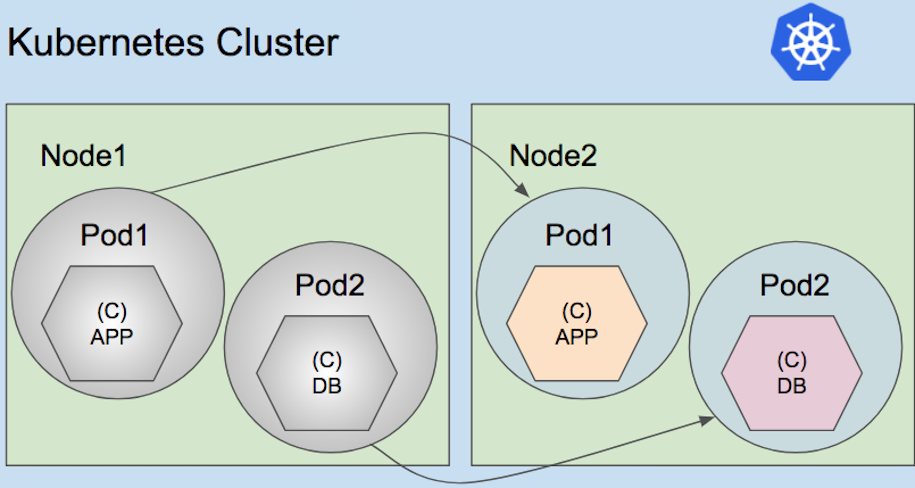
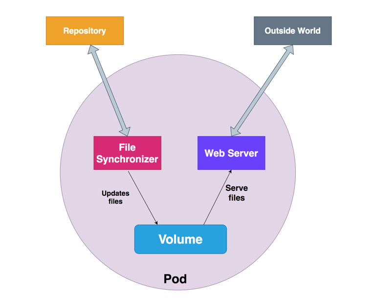
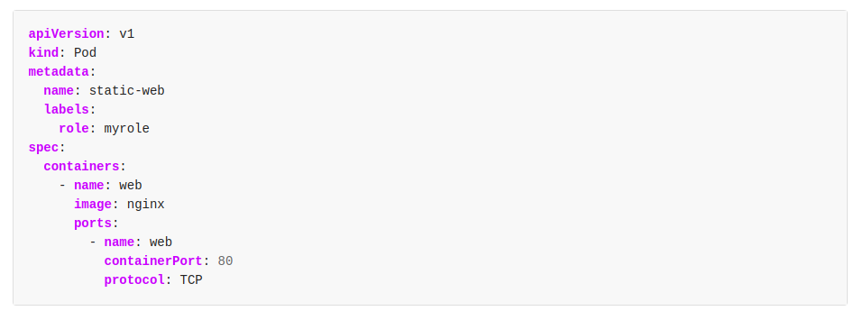

# Pods

Pods is the closest object we of container that we can create on Kubernetes.
We also create containers, but it goes inside the object Pod.


image taken from: https://cloudify.co/blog/migrating-pods-containerized-applications-nodes-kubernetes-cluster-using-cloudify/


- One of the main differences is that pod can carry more than one container.
And you can also share a lot of resources between the containers in the same Pod, like volumes for instance.

Image taken from: https://medium.com/bb-tutorials-and-thoughts/understanding-multi-container-pods-12f5780f3956


Ok, so let's first create a very simple POD.

Creating:
```
$ kubectl run nginx --image=nginx
```

Checking: 
If you perform a quick get pods. You are going to see its in the creating stage.
```
$ kubectl get pods
NAME    READY   STATUS              RESTARTS   AGE
nginx   0/1     ContainerCreating   0          5s
```

After a few seconds
The Pod is running
```
$ kubectl get pods
NAME    READY   STATUS    RESTARTS   AGE
nginx   1/1     Running   0          82s
```

You can also describe your pod, to check if all the data is OK.
Some available data: name of the container(s), images, IPs and many others

```
$ kubectl describe pod nginx
```

This is the imperative way of creating objects with Kubernetes.

But there's also the declarative way where you use yaml files.
So let's browse the official documentation and search for pods

https://kubernetes.io/docs/tasks/configure-pod-container/static-pod/#pods-created-via-http


Some reasons to use the declarative way of creating objects.

If the structure becomes complex: 

- it's not possible to use all parameters with the imperative way.
- It's easier to keep track of versions.
  Let's say: my-pod-nginx-v1.yaml, my-pod-nginx-v2.yaml and so on


Let's use this template and create the POD.
Change the name from static-web to my-web-pod under metadata and name

```
cat << EOF >> mypod-v1.yaml
apiVersion: v1
kind: Pod
metadata:
  name: my-web-pod
  labels:
    role: myrole
spec:
  containers:
    - name: web
      image: nginx
      ports:
        - name: web
          containerPort: 80
          protocol: TCP
EOF
```

To create object from files we use this command

kubectl apply -f mypod-v1.yaml
```
$ kubectl apply -f mypod-v1.yaml
pod/my-web-pod created
```

Lets check the pods

```
$  kubectl get pods
NAME         READY   STATUS    RESTARTS   AGE
my-web-pod   1/1     Running   0          27s
nginx        1/1     Running   0          4m54s
```

Now let's delete both of the pods.

- The one we create with imperative commands, we delete with imperative command
- And the other way around to declarative .

```
$ kubectl delete pod nginx
pod "nginx" deleted

$ kubectl delete -f mypod-v1.yaml
pod "my-web-pod" deleted

$ kubectl get pods
No resources found in default namespace.
```

But specially for quick tests, it's possible to generate files from imperative commands:

- Imagine you want to create a pod using yaml file. but you want to get the template from the command.
- You can use --dry-run=client -o yaml and use the output
```
$ kubectl run nginx --image=nginx --dry-run=client -o yaml
apiVersion: v1
kind: Pod
metadata:
  creationTimestamp: null
  labels:
    run: nginx
  name: nginx
spec:
  containers:
  - image: nginx
    name: nginx
    resources: {}
  dnsPolicy: ClusterFirst
  restartPolicy: Always
status: {}
```
Now let's save this output and edit file to create 2 containers within this pod.
The one is generated with the command. And the second we are going to manually add.
- Image: redis
- Name: redis

```
$ kubectl run nginx --image=nginx --dry-run=client -o yaml > my-pod.yaml
$ vi my-pod.yaml ## Edit the file. he last 4 lines are not needed
                 ## Change the name of the Pod under metada name to my-multi-pod   
```

Our file should look like this.

```
apiVersion: v1
kind: Pod
metadata:
  creationTimestamp: null
  labels:
    run: my-multi-pod  
  name: my-multi-pod  
spec:
  containers:
  - image: nginx
    name: nginx
  - image: redis
    name: redis
```

Now let's create it.
```
$ kubectl apply -f my-pod.yaml
pod/my-multi-pod created
```

It's possible to check that ready count now are 2/2.
Because we have 2 running pods out of 2.

```
$ kubectl get pods
NAME           READY   STATUS    RESTARTS   AGE
my-multi-pod   2/2     Running   0          23s
```

You can describe pod and check info of the POD and both containers.

```
$ kubectl describe pod nginx
```

Let's say one week later one of your pods stop working.

And you realize there's a new version of the POD yaml file.

You can quickly compare with any tool you like best and try to find the difference.

```
$ diff mypod-v1.yaml mypod-v2.yaml
19c19
<       image: nginx
---
>       image: nginx:1.17

```

And this case there was an container image update

##### To practice, type in your terminal:
- `$ question1`
- `$ question2`
- `$ question3`

[<==](../..//README.md) 
&emsp; 
[Home](../../README.md) 
&emsp; 
[==>](05.Replica-set.md)