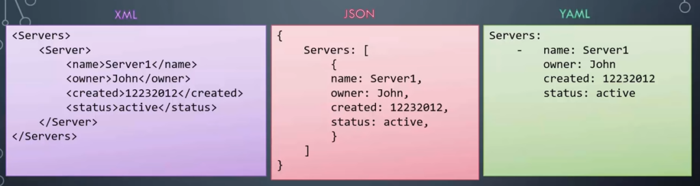
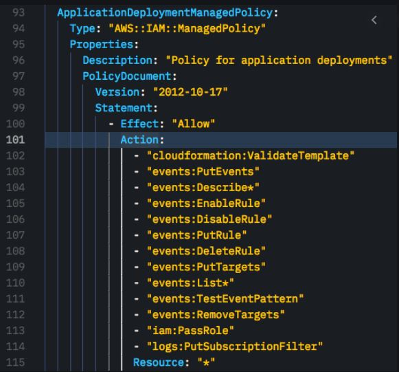
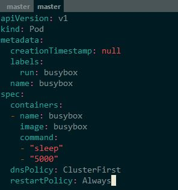
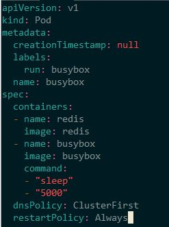

# Yaml

According to yaml.org, 
"YAML is a human friendly data serialization standard for all programming languages"

Comparison between yaml, json, xml

Image takne from: https://www.cyberfella.co.uk/2020/04/13/xml-json-and-yaml/

INDENTATION is key

image taken from: https://hodgkins.io/up-your-cloudformation-game-with-vscode

Lets' analyze a simple pod structure

Let's see the containers list in action

