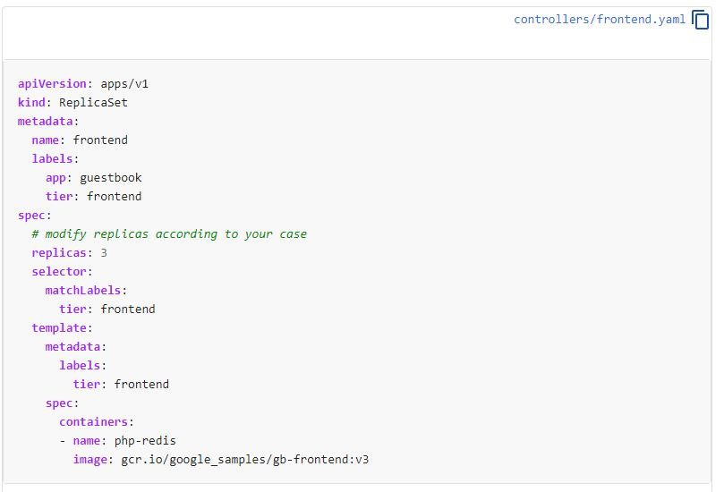
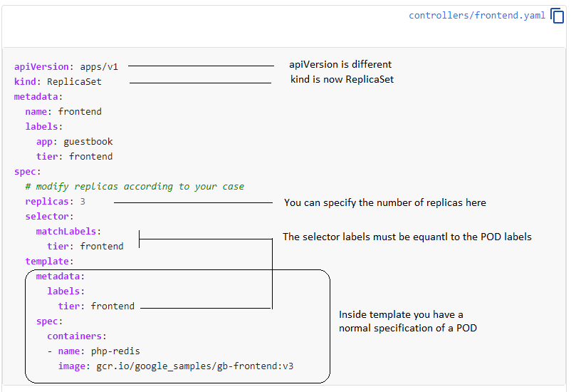

# Replica Set

What happens if you want to scale some POD.

You cannot if the object itself is a POD. you need to have a POD inside a ReplicaSet.


So now let's create a Replica Set.
Let's make use of the official documentation to help us

https://kubernetes.io/docs/concepts/workloads/controllers/replicaset/#example


Lets see what has changed.



So now let's use the exact code and create a ReplicaSet.

```
cat << EOF > rs.yaml
apiVersion: apps/v1
kind: ReplicaSet
metadata:
  name: frontend
  labels:
    app: guestbook
    tier: frontend
spec:
  # modify replicas according to your case
  replicas: 3
  selector:
    matchLabels:
      tier: frontend
  template:
    metadata:
      labels:
        tier: frontend
    spec:
      containers:
      - name: php-redis
        image: gcr.io/google_samples/gb-frontend:v3
EOF
```

Creating
```
$ kubectl apply -f rs.yaml
replicaset.apps/frontend created
```


Check the status of the replicaSet.
Notice that.
The DESIRED number of replicases is 3
The current is 3
And after a while the READU is also 3

```
$ kubectl get replicasets.apps frontend
NAME       DESIRED   CURRENT   READY   AGE
frontend   3         3         3       2m4s
```

Now let's check the PODS

```
$ kubectl get pods
NAME             READY   STATUS    RESTARTS   AGE
apache           1/1     Running   1          4h41m
frontend-fw6kg   1/1     Running   0          3m17s
frontend-nz9rd   1/1     Running   0          3m17s
frontend-zplw7   1/1     Running   0          3m17s
httpd            1/1     Running   1          4h51m
nginx            1/1     Running   1          4h51m
```

Notice that we have 3 pods of the replicaset frontend.
Now let's see in what nodes those pods are running

```
$ kubectl get pods -o wide
NAME             READY   STATUS    RESTARTS   AGE     IP          NODE       NOMINATED NODE   READINESS GATES
apache           1/1     Running   1          4h42m   10.44.0.4   worker01   <none>           <none>
frontend-fw6kg   1/1     Running   0          4m29s   10.44.0.5   worker01   <none>           <none>
frontend-nz9rd   1/1     Running   0          4m29s   10.47.0.3   worker02   <none>           <none>
frontend-zplw7   1/1     Running   0          4m29s   10.47.0.4   worker02   <none>           <none>
httpd            1/1     Running   1          4h52m   10.47.0.2   worker02   <none>           <none>
nginx            1/1     Running   1          4h52m   10.47.0.1   worker02   <none>           <none>
```

Two of them are running on the worker02 and 1 on worker01.
Notice that there are no PODs running on the master.

Now let's scale UP and DOWN this application

First let's scale up modifying the manifest to 5 replicas.

```
$ sed -i 's/replicas: 3/replicas: 5/g' rs.yaml

$ kubectl apply -f rs.yaml
replicaset.apps/frontend configured
```
Notice how the desire number changed to 5.
And also the current PODS
```
$ kubectl get replicasets.apps
NAME       DESIRED   CURRENT   READY   AGE
frontend   5         5         5       7m51s

$ kubectl get pods -o wide
NAME             READY   STATUS    RESTARTS   AGE     IP          NODE       NOMINATED NODE   READINESS GATES
apache           1/1     Running   1          4h46m   10.44.0.4   worker01   <none>           <none>
frontend-25z82   1/1     Running   0          32s     10.47.0.5   worker02   <none>           <none>
frontend-fw6kg   1/1     Running   0          7m55s   10.44.0.5   worker01   <none>           <none>
frontend-nz9rd   1/1     Running   0          7m55s   10.47.0.3   worker02   <none>           <none>
frontend-v5rjp   1/1     Running   0          32s     10.44.0.6   worker01   <none>           <none>
frontend-zplw7   1/1     Running   0          7m55s   10.47.0.4   worker02   <none>           <none>
httpd            1/1     Running   1          4h55m   10.47.0.2   worker02   <none>           <none>
nginx            1/1     Running   1          4h56m   10.47.0.1   worker02   <none>           <none>
```

Let's try to delelete this POD: frontend-zplw7

```
$ kubectl delete pod frontend-zplw7
pod "frontend-zplw7" deleted
```

The command ran successfully. Let's check again.
Notice that the POD was successfully delete. 
But ReplicaSet enforce your system to have the desired number of PDDs actually running.
So it create another one
```
$ kubectl get rs
NAME       DESIRED   CURRENT   READY   AGE
frontend   5         5         5       9m51s


$ kubectl get pod -o wide
NAME             READY   STATUS    RESTARTS   AGE     IP          NODE       NOMINATED NODE   READINESS GATES
apache           1/1     Running   1          4h48m   10.44.0.4   worker01   <none>           <none>
frontend-25z82   1/1     Running   0          2m33s   10.47.0.5   worker02   <none>           <none>
frontend-8h8j6   1/1     Running   0          41s     10.44.0.7   worker01   <none>           <none>
frontend-fw6kg   1/1     Running   0          9m56s   10.44.0.5   worker01   <none>           <none>
frontend-nz9rd   1/1     Running   0          9m56s   10.47.0.3   worker02   <none>           <none>
frontend-v5rjp   1/1     Running   0          2m33s   10.44.0.6   worker01   <none>           <none>
httpd            1/1     Running   1          4h58m   10.47.0.2   worker02   <none>           <none>
nginx            1/1     Running   1          4h58m   10.47.0.1   worker02   <none>           <none>
```

Now let's scale down using command line 

```
$ kubectl scale replicaset frontend --replicas=2
replicaset.apps/frontend scaled
```

Checking

2 replicas as expected
```
$ kubectl get rs
NAME       DESIRED   CURRENT   READY   AGE
frontend   2         2         2       12m
```

To end this session let's use the manifest to change the image to nginx
```
cat << EOF > rs.yaml
apiVersion: apps/v1
kind: ReplicaSet
metadata:
  name: frontend
  labels:
    app: guestbook
    tier: frontend
spec:
  # modify replicas according to your case
  replicas: 2
  selector:
    matchLabels:
      tier: frontend
  template:
    metadata:
      labels:
        tier: frontend
    spec:
      containers:
      - name: php-redis
        image: nginx
EOF
```

Use kubectl apply

```
$ kubectl apply -f rs.yaml
```

```
$ kubectl delete pod frontend-nz9rd
pod "frontend-nz9rd" deleted
```

Describe both PODs of the ReplicaSet frontend and grep for the image:
```
$ kubectl get pods
NAME             READY   STATUS    RESTARTS   AGE
apache           1/1     Running   1          4h59m
frontend-d6wjd   1/1     Running   0          37s
frontend-fw6kg   1/1     Running   0          21m
httpd            1/1     Running   1          5h9m
nginx            1/1     Running   1          5h9m

$ kubectl describe pod frontend-d6wjd | grep -i image:
    Image:          nginx

$ kubectl describe pod frontend-fw6kg | grep -i image:
    Image:          gcr.io/google_samples/gb-frontend
```

Notice that only the POD tha was re-created because we manually deleted one POD is running the new image:
The POD we didn't touch is still running the old image.

ReplicaSet can dynamically change most of the ReplicaSet parameters in the run time.
But not the most of POD parameters. For that we need recreate the PODs or the entire RS.

To quickly re-create the entire RS

```
$ kubectl replace -f rs.yaml --force
replicaset.apps "frontend" deleted
replicaset.apps/frontend replaced
```

Checking
```
$ kubectl get rs
NAME       DESIRED   CURRENT   READY   AGE
frontend   2         2         2       26s


$ kubectl get pods
NAME             READY   STATUS    RESTARTS   AGE
apache           1/1     Running   1          5h5m
frontend-2g7kt   1/1     Running   0          43s
frontend-lx2xb   1/1     Running   0          43s
httpd            1/1     Running   1          5h15m
nginx            1/1     Running   1          5h15m

$ kubectl describe pod frontend-2g7kt | grep -i image:
    Image:          nginx

]$ kubectl describe pod frontend-lx2xb | grep -i image:
    Image:          nginx

```

##### To practice, type in your terminal:
- `$ question4`
- `$ question5`
- `$ question6`

[<==](01.01.pod.md) 
&emsp; 
[Home](../../README.md) 
&emsp; 
[==>](10.Deployments.md)