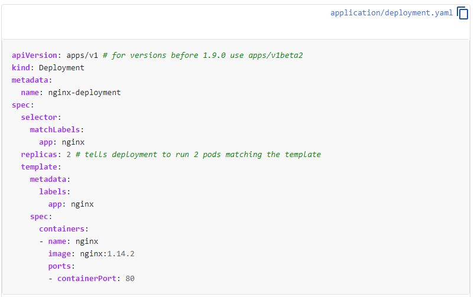

# Deployment

Let's then crete a new object, deployment, to overcome some of the Replica-Set hurdles.

https://kubernetes.io/docs/tasks/run-application/run-stateless-application-deployment/#creating-and-exploring-an-nginx-deployment


Notice that's very similar to ReplicaSet.

So now let's use the exact code and create a Deployment.

```
cat << EOF > deploy.yaml
apiVersion: apps/v1 # for versions before 1.9.0 use apps/v1beta2
kind: Deployment
metadata:
  name: nginx-deployment
spec:
  selector:
    matchLabels:
      app: nginx
  replicas: 2 # tells deployment to run 2 pods matching the template
  template:
    metadata:
      labels:
        app: nginx
    spec:
      containers:
      - name: nginx
        image: nginx:1.14.2
        ports:
        - containerPort: 80
EOF
```

Creating
```
$ kubectl apply -f deploy.yaml
deployment.apps/nginx-deployment created

```

Wait for the PODs to come up and check all. <br />
Notice that we have created de Deployment and automatically it created a replicaSet.

```
$ kubectl get all
NAME                                    READY   STATUS    RESTARTS   AGE
pod/nginx-deployment-66b6c48dd5-67sst   1/1     Running   0          98s
pod/nginx-deployment-66b6c48dd5-lvmgq   1/1     Running   0          98s

NAME                 TYPE        CLUSTER-IP   EXTERNAL-IP   PORT(S)   AGE
service/kubernetes   ClusterIP   10.96.0.1    <none>        443/TCP   127m

NAME                               READY   UP-TO-DATE   AVAILABLE   AGE
deployment.apps/nginx-deployment   2/2     2            2           98s

NAME                                          DESIRED   CURRENT   READY   AGE
replicaset.apps/nginx-deployment-66b6c48dd5   2         2         2       98s
```

Scale the deployment to 6 replicas

```
$ kubectl scale deployment nginx-deployment --replicas=6
deployment.apps/nginx-deployment scaled
```

Wait for all the pods to get running status. <br />
And now change it's image

```
$ kubectl set image deployment nginx-deployment nginx=nginx:1.16 --record
deployment.apps/nginx-deployment image updated
```

Check Status <br />
Notice that deployment will automatically recreate your PODs with the proper image <br />
But it will do it step by step ensuring your system is always healthy <br />
Observe that at the moment of the print we had 9 PODs. <br />

- 3 at Creating stage
- 1 at Terminating stage
- 5 at Running Stage


```
$ kubectl get all
NAME                                    READY   STATUS              RESTARTS   AGE
pod/nginx-deployment-644599b9c9-5dhf9   1/1     Running             0          35s
pod/nginx-deployment-644599b9c9-9vb59   0/1     ContainerCreating   0          35s
pod/nginx-deployment-644599b9c9-dg8bf   0/1     ContainerCreating   0          34s
pod/nginx-deployment-644599b9c9-k7lss   0/1     ContainerCreating   0          1s
pod/nginx-deployment-66b6c48dd5-2hp2h   1/1     Running             0          2m48s
pod/nginx-deployment-66b6c48dd5-67sst   1/1     Running             0          7m48s
pod/nginx-deployment-66b6c48dd5-h8kc7   1/1     Terminating         0          2m48s
pod/nginx-deployment-66b6c48dd5-lvmgq   1/1     Running             0          7m48s
pod/nginx-deployment-66b6c48dd5-nkx76   1/1     Running             0          2m48s

NAME                 TYPE        CLUSTER-IP   EXTERNAL-IP   PORT(S)   AGE
service/kubernetes   ClusterIP   10.96.0.1    <none>        443/TCP   133m

NAME                               READY   UP-TO-DATE   AVAILABLE   AGE
deployment.apps/nginx-deployment   5/6     4            5           7m48s

NAME                                          DESIRED   CURRENT   READY   AGE
replicaset.apps/nginx-deployment-644599b9c9   4         4         1       35s
replicaset.apps/nginx-deployment-66b6c48dd5   4         4         4       7m48s
```


That means deployment will create new PODs with the proper image. <br />
And as soon new PODs are running it will terminate older PODs. <br />
So at the end you will have the desired PODs running with the proper image. <br />
So we can now easily upgrade application software with one command and no downtime <br />

If you command get events
```
$ kubectl get events | grep -i scale
16m         Normal   ScalingReplicaSet   deployment/nginx-deployment              Scaled up replica set nginx-deployment-66b6c48dd5 to 2
11m         Normal   ScalingReplicaSet   deployment/nginx-deployment              Scaled up replica set nginx-deployment-66b6c48dd5 to 6
8m56s       Normal   ScalingReplicaSet   deployment/nginx-deployment              Scaled up replica set nginx-deployment-644599b9c9 to 2
8m55s       Normal   ScalingReplicaSet   deployment/nginx-deployment              Scaled down replica set nginx-deployment-66b6c48dd5 to 5
8m55s       Normal   ScalingReplicaSet   deployment/nginx-deployment              Scaled up replica set nginx-deployment-644599b9c9 to 3
8m22s       Normal   ScalingReplicaSet   deployment/nginx-deployment              Scaled down replica set nginx-deployment-66b6c48dd5 to 4
8m22s       Normal   ScalingReplicaSet   deployment/nginx-deployment              Scaled up replica set nginx-deployment-644599b9c9 to 4
8m20s       Normal   ScalingReplicaSet   deployment/nginx-deployment              Scaled down replica set nginx-deployment-66b6c48dd5 to 3
8m20s       Normal   ScalingReplicaSet   deployment/nginx-deployment              Scaled up replica set nginx-deployment-644599b9c9 to 5
```

You will see that first it scaled up 3 new PODs. And then terminate 1. <br />
After that it scale up 1 and scale down 1. <br />

Keeping at least 4 or 5 PODs running.

Check all objects again and see that we now have 2 ReplicaSet.
- The first one running 6 PODs has our image update.
- The second one keeps registry of the previous configuration in case rollback is needed.

```
$ kubectl get all -o wide
NAME                                    READY   STATUS    RESTARTS   AGE   IP          NODE       NOMINATED NODE   READINESS GATES
pod/nginx-deployment-644599b9c9-5dhf9   1/1     Running   0          11m   10.36.0.2   worker02   <none>           <none>
pod/nginx-deployment-644599b9c9-9vb59   1/1     Running   0          11m   10.44.0.7   worker01   <none>           <none>
pod/nginx-deployment-644599b9c9-bt8mh   1/1     Running   0          10m   10.44.0.5   worker01   <none>           <none>
pod/nginx-deployment-644599b9c9-dg8bf   1/1     Running   0          11m   10.36.0.4   worker02   <none>           <none>
pod/nginx-deployment-644599b9c9-k7lss   1/1     Running   0          10m   10.36.0.5   worker02   <none>           <none>
pod/nginx-deployment-644599b9c9-mnkkm   1/1     Running   0          10m   10.36.0.1   worker02   <none>           <none>

NAME                 TYPE        CLUSTER-IP   EXTERNAL-IP   PORT(S)   AGE    SELECTOR
service/kubernetes   ClusterIP   10.96.0.1    <none>        443/TCP   144m   <none>

NAME                               READY   UP-TO-DATE   AVAILABLE   AGE   CONTAINERS   IMAGES       SELECTOR
deployment.apps/nginx-deployment   6/6     6            6           18m   nginx        nginx:1.16   app=nginx

NAME                                          DESIRED   CURRENT   READY   AGE   CONTAINERS   IMAGES         SELECTOR
replicaset.apps/nginx-deployment-644599b9c9   6         6         6       11m   nginx        nginx:1.16     app=nginx,pod-template-hash=644599b9c9
replicaset.apps/nginx-deployment-66b6c48dd5   0         0         0       18m   nginx        nginx:1.14.2   app=nginx,pod-template-hash=66b6c48dd5
```

Let's again change the image to a new version

```
$ kubectl set image deployment nginx-deployment nginx=nginx:1.18 --record
deployment.apps/nginx-deployment image updated
```

Now we must have 3 replicaSet. <br />
In case you want to sell all your history changes, perform the following: kubectl rollout history deployment nginx-deployment

```
$ kubectl rollout history deployment nginx-deployment
deployment.apps/nginx-deployment
REVISION  CHANGE-CAUSE
1         <none>
2         kubectl set image deployment nginx-deployment nginx=nginx:1.16 --record=true
3         kubectl set image deployment nginx-deployment nginx=nginx:1.18 --record=true
```

In case you want to rollback to the first setting use:
-  kubectl rollout undo deployment nginx-deployment --to-revision=1 

In case you want to rollback to the first setting use:
-  kubectl rollout undo deployment nginx-deployment --to-revision=2 

```
$ kubectl rollout undo deployment nginx-deployment --to-revision=2
deployment.apps/nginx-deployment rolled back
```

And again you can easily and with no downtime perform rollback on your application


##### To practice, type in your terminal:
- `$ question7`
- `$ question8`
- `$ question9`

[<==](05.Replica-set.md) 
&emsp; 
[Home](../../README.md) 
&emsp; 
[==>](25.Labels-and-selectors.md)