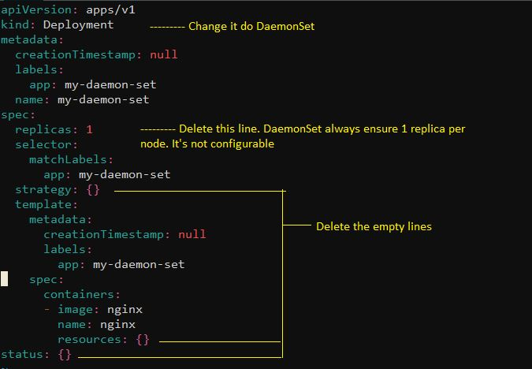

# DaemonSet

Typical use cases for daemon-set according to documentation: https://kubernetes.io/docs/concepts/workloads/controllers/daemonset/

 - running a cluster storage daemon on every node
 - running a logs collection daemon on every node
 - running a node monitoring daemon on every node


So it's possible to note that they are good to ensure there is one replica on every node

As of kubernetes current version, it's not possible to create daemonset imperatively.

So let's create a manifest from deployment and change it a little bit

```
$ kubectl create deployment  my-daemon-set --image=nginx --dry-run=client -o yaml > my-daemon-set.yaml
```

Please see necessary Changes



- Create DaemonSet
```
$ kubectl apply -f my-daemon-set.yaml
daemonset.apps/my-daemon-set created
```

- And then you have one copy in each of your worker nodes
```
$ kubectl get pods -o wide
NAME                  READY   STATUS    RESTARTS   AGE    IP          NODE       NOMINATED NODE   READINESS GATES
my-daemon-set-dqvcq   1/1     Running   0          110s   10.44.0.6   worker01   <none>           <none>
my-daemon-set-m4j77   1/1     Running   0          110s   10.36.0.1   worker02   <none>           <none>
```

If you delete the POD, it's going to come back.
You need to delete the DaemonSet for them to go away

- Deleting PODs

```
$ kubectl delete pod my-daemon-set-m4j77
pod "my-daemon-set-m4j77" deleted


$ kubectl delete pod my-daemon-set-dqvcq
pod "my-daemon-set-dqvcq" deleted

$ kubectl get all
NAME                      READY   STATUS    RESTARTS   AGE
pod/my-daemon-set-crw9f   1/1     Running   0          17s
pod/my-daemon-set-h7mzc   1/1     Running   0          4s

NAME                 TYPE        CLUSTER-IP   EXTERNAL-IP   PORT(S)   AGE
service/kubernetes   ClusterIP   10.96.0.1    <none>        443/TCP   93m

NAME                           DESIRED   CURRENT   READY   UP-TO-DATE   AVAILABLE   NODE SELECTOR   AGE
daemonset.apps/my-daemon-set   2         2         2       2            2           <none>          3m26s
```

- Deleting DaemonSets

```
$ kubectl delete daemonset.apps/my-daemon-set
daemonset.apps "my-daemon-set" deleted

$ kubectl get all
NAME                      READY   STATUS        RESTARTS   AGE
pod/my-daemon-set-h7mzc   0/1     Terminating   0          23s

NAME                 TYPE        CLUSTER-IP   EXTERNAL-IP   PORT(S)   AGE
service/kubernetes   ClusterIP   10.96.0.1    <none>        443/TCP   94m


$ kubectl get all
NAME                 TYPE        CLUSTER-IP   EXTERNAL-IP   PORT(S)   AGE
service/kubernetes   ClusterIP   10.96.0.1    <none>        443/TCP   94m
```

##### To practice, type in your terminal:
Under development

[<==](10.Deployments.md) 
&emsp; 
[Home](../../README.md) 
&emsp; 
[==>](20.Static-Pod.md)