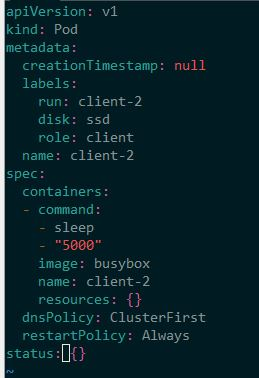

# Labels and Selectors

Every Kubernetes object has labels attached.

Let's check some POD Labels using show labels

```
$ kubectl get pods --show-labels
NAME       READY   STATUS              RESTARTS   AGE   LABELS
client-1   0/1     ContainerCreating   0          13s   run=client-1
client-2   0/1     ContainerCreating   0          8s    run=client-2
nginx      0/1     ContainerCreating   0          61s   run=nginx
redis      0/1     ContainerCreating   0          53s   run=redis
```

Now let's list only the run=redis label, using -l
```
$ kubectl get pods -l=run=redis
NAME    READY   STATUS    RESTARTS   AGE
redis   1/1     Running   0          2m13s
```

Now let's list all pods without run=redis using selector
```
$  kubectl get pods --selector='run!=redis'
NAME       READY   STATUS    RESTARTS   AGE
client-1   1/1     Running   0          5m20s
client-2   1/1     Running   0          5m15s
nginx      1/1     Running   0          6m8s
```

client-1 and client-2 seem to have the same role.
So let's make it better adding proper labels
```
$ kubectl label pod client-1 role=client
pod/client-1 labeled
$ kubectl label pod client-2 role=client
pod/client-2 labeled
```

Checking
```
$ kubectl get pods --show-labels
NAME       READY   STATUS    RESTARTS   AGE     LABELS
client-1   1/1     Running   0          7m14s   role=client,run=client-1
client-2   1/1     Running   0          7m9s    role=client,run=client-2
nginx      1/1     Running   0          8m2s    run=nginx
redis      1/1     Running   0          7m54s   run=redis
```

Now Let's get pods role=client
```
$ kubectl get pods -l=role=client
NAME       READY   STATUS    RESTARTS   AGE
client-1   1/1     Running   0          8m5s
client-2   1/1     Running   0          8m
```

Let's delete pods with role=client

```
$ kubectl delete pod -l=role=client
pod "client-1" deleted
pod "client-2" deleted
```

You can also seet your labels in the manifest (yaml) file



```
$ kubectl get pods --show-labels
NAME       READY   STATUS    RESTARTS   AGE   LABELS
client-2   1/1     Running   0          17s   disk=ssd,role=client,run=client-2
nginx      1/1     Running   0          13m   run=nginx
redis      1/1     Running   0          13m   run=redis
```
To remove a label use the key of the labels and minus (-), like: run-

```
$ kubectl label pod client-2 run-
pod/client-2 labeled
$ kubectl get pods --show-labels
NAME       READY   STATUS    RESTARTS   AGE    LABELS
client-2   1/1     Running   0          3m9s   disk=ssd,role=client
nginx      1/1     Running   0          16m    run=nginx
redis      1/1     Running   0          15m    run=redis
```

##### To practice, type in your terminal:
- `$ question10`
- `$ question11`
- `$ question12`
- `$ question13`

[<==](20.Static-Pod.md) 
&emsp; 
[Home](../../README.md) 
&emsp; 
[==>](30.Namespaces.md)