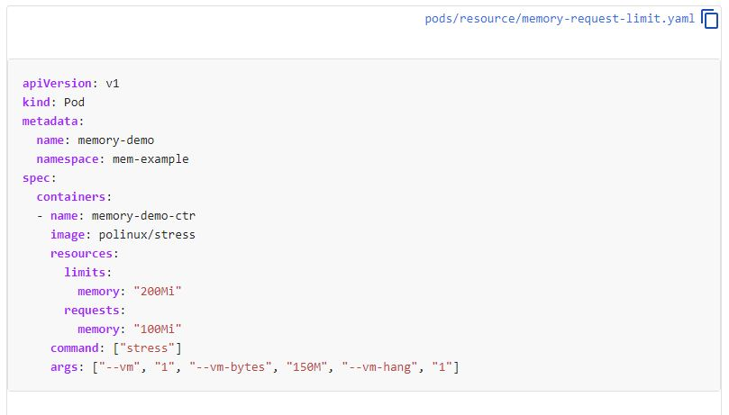

# Metrics Server and Resources

Metrics server is a tool that help us keep track how pods are using the cluster resources,
and how the nodes are being able to handle it

- Installation
```
kubectl apply -f https://github.com/kubernetes-sigs/metrics-server/releases/download/v0.3.7/components.yaml
```
Checking resources by nodes
```
$ kubectl top nodes
NAME       CPU(cores)   CPU%   MEMORY(bytes)   MEMORY%
master     331m         16%    1239Mi          71%
worker01   167m         8%     584Mi           65%
worker02   129m         6%     512Mi           57%
```

Checking resources by pods

```
$ kubectl top pod
NAME       CPU(cores)   MEMORY(bytes)
client-2   0m           0Mi
nginx      0m           1Mi
redis      3m           3Mi
```

You can use sort by cpu or memory.
```
$ kubectl top nodes --sort-by=memory
NAME       CPU(cores)   CPU%   MEMORY(bytes)   MEMORY%
master     358m         17%    1240Mi          71%
worker01   209m         10%    586Mi           65%
worker02   165m         8%     511Mi           57%
```

Now let's control how our PODs can use resources.

documentation: https://kubernetes.io/docs/tasks/configure-pod-container/assign-memory-resource/#specify-a-memory-request-and-a-memory-limit



Let's apply this manifest.
Do not use namespace line

Notice that we have 2 keys unders resources
 - Requests - This is the minimum necessary for the PODs to run.
 - Limit - This is a cap limit for the POD.
 
You can use on or another, but right now, we are setting both

```
cat << EOF > my-res-pod-test.yaml
apiVersion: v1
kind: Pod
metadata:
  name: memory-demo
spec:
  containers:
  - name: memory-demo-ctr
    image: polinux/stress
    resources:
      limits:
        memory: "200Mi"
      requests:
        memory: "100Mi"
    command: ["stress"]
    args: ["--vm", "1", "--vm-bytes", "150M", "--vm-hang", "1"]
EOF

$ kubectl apply -f my-res-pod-test.yaml
pod/memory-demo created
```
Checking top pods sorting by cpu
```
$ kubectl top pod --sort-by=cpu
NAME          CPU(cores)   MEMORY(bytes)
memory-demo   166m         15Mi
redis         2m           2Mi
client-2      0m           0Mi
nginx         0m           1Mi
```

Now let's stress our POD to use 250Mi memory.

```
cat << EOF > my-res-pod-test.yaml
apiVersion: v1
kind: Pod
metadata:
  name: memory-demo
spec:
  containers:
  - name: memory-demo-ctr
    image: polinux/stress
    resources:
      limits:
        memory: "200Mi"
      requests:
        memory: "100Mi"
    command: ["stress"]
    args: ["--vm", "1", "--vm-bytes", "250M", "--vm-hang", "1"]
EOF

$ kubectl replace -f my-res-pod-test.yaml --force
pod "memory-demo" deleted
pod/memory-demo replaced
```
Check POD status
```
$ kubectl get pods
NAME          READY   STATUS             RESTARTS   AGE
client-2      1/1     Running            0          34m
memory-demo   0/1     CrashLoopBackOff   3          85s
nginx         1/1     Running            0          47m
redis         1/1     Running            0          47m

$ kubectl top pods
NAME          CPU(cores)   MEMORY(bytes)
client-2      0m           0Mi
memory-demo   0m           0Mi
nginx         0m           1Mi
redis         2m           2Mi
```

Describe POD to check what happened <br />

It was terminated for the reason: OOMKilled <br />
Out of memory killed

```
$ kubectl describe pod memory-demo | grep State: -A5
    State:          Waiting
      Reason:       CrashLoopBackOff
    Last State:     Terminated
      Reason:       OOMKilled
      Exit Code:    1
      Started:      Tue, 27 Oct 2020 11:24:48 -0300
      Finished:     Tue, 27 Oct 2020 11:24:48 -0300
    Ready:          False
```
Clean up
```
$ kubectl delete -f my-res-pod-test.yaml
pod "memory-demo" deleted
```

##### To practice, type in your terminal:
Under Development

[<==](30.Namespaces.md) 
&emsp; 
[Home](../../README.md) 
&emsp; 
[==>](40.AutoScaling.md)