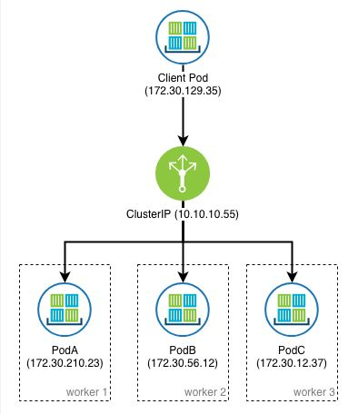

# Services

There are 4 types of Services in Kubernetes.

https://kubernetes.io/docs/concepts/services-networking/service/#publishing-services-service-types

Let's skip externalName for a while and talk about the 3 most important services:
- ClusterIP
- NodePort
- LoadBalancer

Let's imagine you have a web server like nginx running.
If you don't have it, create it.

```
$ kubectl create deployment nginx --image=nginx --replicas=3
deployment.apps/nginx created

$ kubectl get pods -o wide
]NAME                     READY   STATUS    RESTARTS   AGE   IP          NODE       NOMINATED NODE   READINESS GATES
nginx-6799fc88d8-57gdv   1/1     Running   0          37s   10.44.0.6   worker01   <none>           <none>
nginx-6799fc88d8-rwmdq   1/1     Running   0          37s   10.36.0.1   worker02   <none>           <none>
nginx-6799fc88d8-sczp2   1/1     Running   0          37s   10.36.0.2   worker02   <none>           <none>
```

You can access the service by using one of the Pods IP.
But that's no good.
- You must keep track of IPs
- There is no name resolution
- Trouble if you scale down/up

```
$ curl --silent 10.44.0.6 | grep -i welcome
<title>Welcome to nginx!</title>
<h1>Welcome to nginx!</h1>
```

So we create a service to make things better.

### Cluster IP

Starting with ClusterIP  (Default Service)

This service is good when you want to expose your services to other services/pos inside your cluster.

You can create it imperatively or declaratively.

```
$ kubectl expose deployment nginx --name=nginx-service --type=ClusterIP --port=80
```

or with yaml file
```
apiVersion: v1
kind: Service
metadata:
  creationTimestamp: null
  labels:
    app: nginx
  name: nginx-service
spec:
  ports:
  - port: 80
    protocol: TCP
    targetPort: 80
  selector:
    app: nginx
  type: ClusterIP
status:
  loadBalancer: {}
```

Checking the service
```
$ kubectl get service
NAME            TYPE        CLUSTER-IP      EXTERNAL-IP   PORT(S)   AGE
kubernetes      ClusterIP   10.96.0.1       <none>        443/TCP   35h
nginx-service   ClusterIP   10.108.89.149   <none>        80/TCP    5s
```
or using shortname
```
$ kubectl get svc
NAME            TYPE        CLUSTER-IP      EXTERNAL-IP   PORT(S)   AGE
kubernetes      ClusterIP   10.96.0.1       <none>        443/TCP   35h
nginx-service   ClusterIP   10.108.89.149   <none>        80/TCP    9s
```

Now you other PODs can access your nginx-service using the name nginx-service.
And we can use Cluster-IP to test it from the shell. 
(Now we don't need to worry about PODs IP, if they are scaling down or up)

- Testing from shell
```
$ curl --silent 10.108.89.149 | grep -i welcome
<title>Welcome to nginx!</title>
<h1>Welcome to nginx!</h1>
```

- Testing from another POD
```
$  kubectl run tester --image=ubuntu -i --tty
If you don't see a command prompt, try pressing enter.
root@tester:/# 

$ apt update
$ apt install curl -y

$ curl --silent nginx-service | grep -i welcome
<title>Welcome to nginx!</title>
<h1>Welcome to nginx!</h1>
```

Image taken from: https://www.ibm.com/support/knowledgecenter/en/SSBS6K_3.1.1/manage_network/kubernetes_types.html




##### To practice, type in your terminal:
Under Development

[<==](40.AutoScaling.md) 
&emsp; 
[Home](../../README.md) 
&emsp; 
[==>](46.Services-Cluster-NodePort.md)