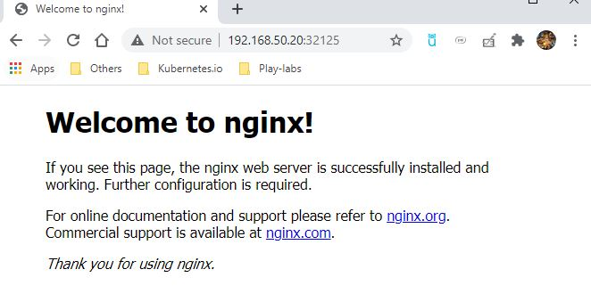
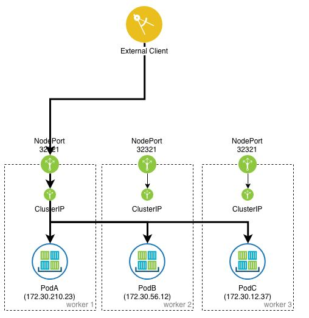

# Services

### Node Port

Now, imagine that you don't want access ONLY inside the cluster, but also from outside.

- Deleting the current service and tester POD
```
$ kubectl delete pod tester
pod "tester" deleted

$ kubectl delete svc nginx-service
service "nginx-service" deleted
```

- Recreate changing the type to NodePort
```
$ kubectl expose deployment nginx --name=nginx-service --type=NodePort --port=80
service/nginx-service exposed
```

- Checking (The output is a bit different)
 - You still have a ClusterIP (All NodePorts keeps ClusterIP functionality)
 - But now you have a high port that you can access from outside of your Cluster.
```
$ kubectl get svc
NAME            TYPE        CLUSTER-IP       EXTERNAL-IP   PORT(S)        AGE
kubernetes      ClusterIP   10.96.0.1        <none>        443/TCP        36h
nginx-service   NodePort    10.103.154.161   <none>        80:32125/TCP   56s
```

- So go to your web-browser and type the IP of one of the nodes and the given port:
 - my case: 192.168.50.20:32125 

 
 
 Image taken from: https://www.ibm.com/support/knowledgecenter/en/SSBS6K_3.1.1/manage_network/kubernetes_types.html
 
 
##### To practice, type in your terminal:
Under Development

[<==](45.Services-Cluster-IP.md) 
&emsp; 
[Home](../../README.md) 
&emsp; 
[==>](47.Services-Cluster-LoadBalancer.md)