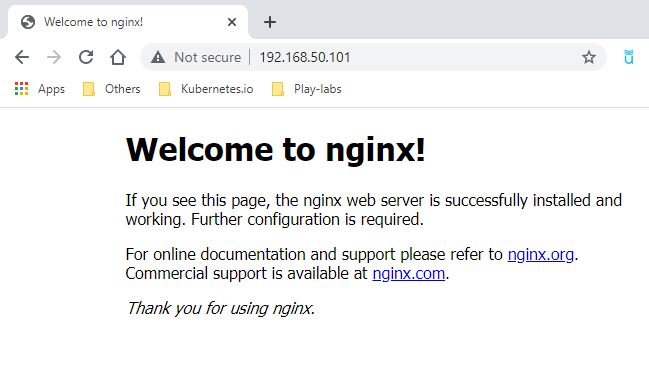
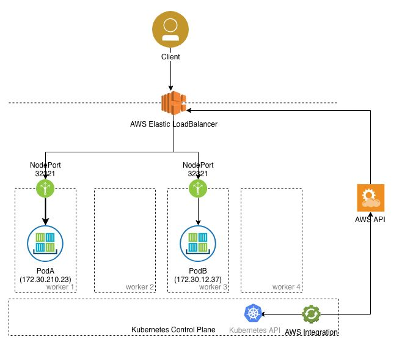

# Services

 ### LoadBalancer
   
 - Cloud environments usually provide external LoadBalancers.
    - So it will balance your traffic trough the nodes automatically
    - And it will give an easy access to users for using regular ports
    
 To make LoadBalancer work on BareMetal deployment, I have installed Metal LoadBalancer. <br />
 It's not the scope of the presentation, so if we have time we talk about it's installation at the end. <br />
 But that's mostly a cloud provider feature. <br />
 
Let's delete out node Port service.
```
$ kubectl delete svc nginx-service
service "nginx-service" deleted
```

Recreating with Load Balancer type
```
$ kubectl expose deployment nginx --name=nginx-service --type=LoadBalancer --port=80
service/nginx-service exposed
```

Checking
```
$ kubectl get svc
NAME            TYPE           CLUSTER-IP      EXTERNAL-IP      PORT(S)        AGE
kubernetes      ClusterIP      10.96.0.1       <none>           443/TCP        36h
nginx-service   LoadBalancer   10.109.193.64   192.168.50.101   80:30750/TCP   44s
```

Notice that:
 - We still have our ClusterIP
 - We still have our NodePort
 - And now we have an external-ip using the regular network IP
 
Let's try to access it from our browser. <br />
And there we go. 
    - No high Ports
    - No need to worry about PODs IP or balancing
    


Image taken from: https://www.ibm.com/support/knowledgecenter/en/SSBS6K_3.1.1/manage_network/kubernetes_types.html


 
 We didn't use Amazon Load Balancer like in the figure, but it's the same idea
 
 ##### To practice, type in your terminal:
Under Development

[<==](46.Services-Cluster-NodePort.md) 
&emsp; 
[Home](../../README.md) 
&emsp; 
[==>](50.Taints-and-Tolerations.md)